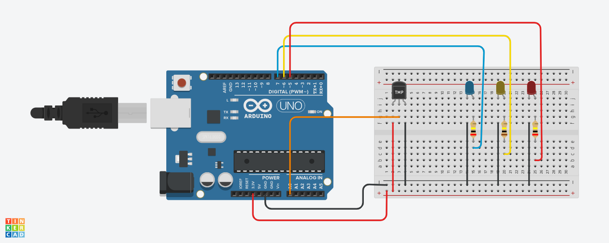
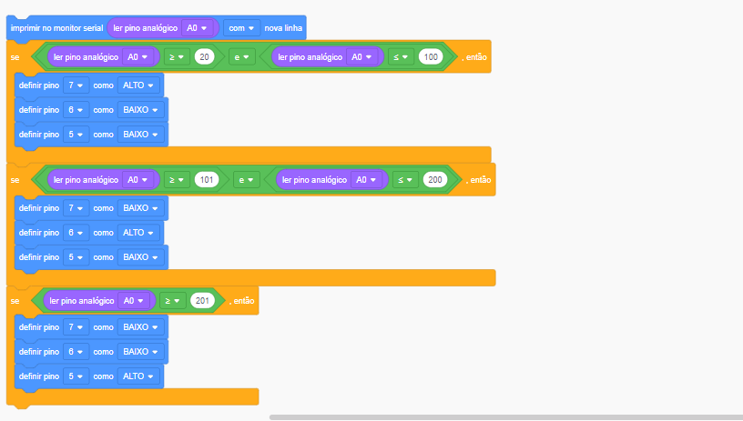

# Medidor de temperatura com Arduino

Criando um medidor de temperatura com um emulador de <b>Arduino</b>. 
Projeto prático para conhecer os componentes e funcionabilidades de um Arduino

<h6 align="center"><a href="https://www.tinkercad.com/things/l0G1PwG56Xf-ingenious-uusam-luulia/editel?sharecode=DUY0p67Eeuh4_2xX9lLbWc0INgFID1nqd-Cs9b46xoI">
** Link do projeto ** </a></h6>

 

## Funcionalidades e ações realizadas pelo programa:

### Configuração Inicial:

* Define o pino A0 como entrada para o sensor analógico de temperatura.
* Inicia a comunicação serial a uma taxa de 9600 bps.
Define os pinos 7, 6 e 5 como saídas para controlar LEDs.

### Loop Principal:

* Imprime o valor lido do pino analógico A0 no monitor serial.
* Realiza três verificações condicionais com base no valor lido do sensor para controlar os LEDs de acordo com faixas de valores.

### Condições e Controle dos LEDs:

#### Se o valor lido do sensor estiver entre 20 e 100:
* Liga o LED conectado ao pino 7.
* Desliga os LEDs conectados aos pinos 6 e 5.

#### Se o valor lido do sensor estiver entre 101 e 200:
* Liga o LED conectado ao pino 6.
* Desliga os LEDs conectados aos pinos 7 e 5.

#### Se o valor lido do sensor for maior ou igual a 201:
* Liga o LED conectado ao pino 5.
* Desliga os LEDs conectados aos pinos 7 e 6.

#### Atraso:
* Introduz um atraso de 10 milissegundos no final do loop para melhorar o desempenho da simulação.

<h3>Contribuindo</h3>

⭐️ Star o projeto

🐛 Encontrar e relatar issues

